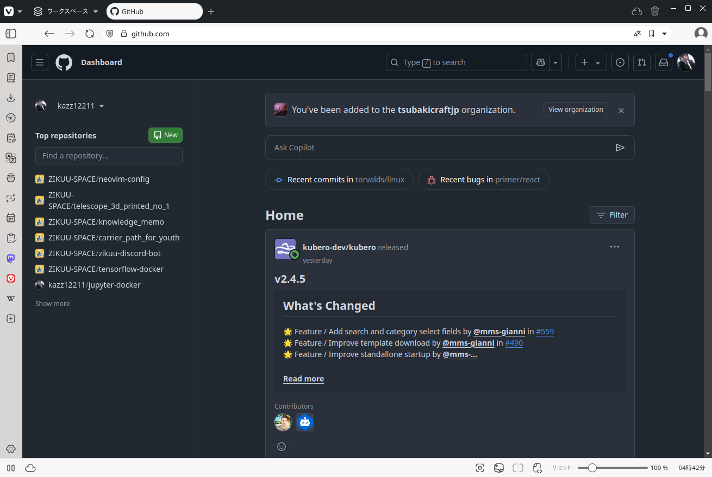
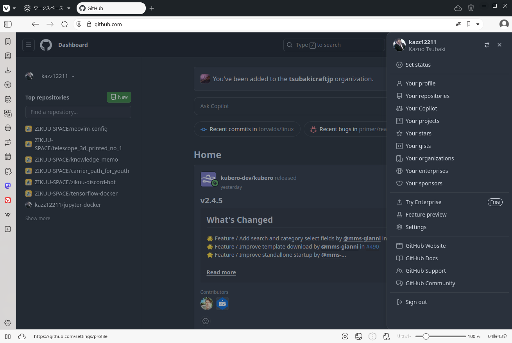
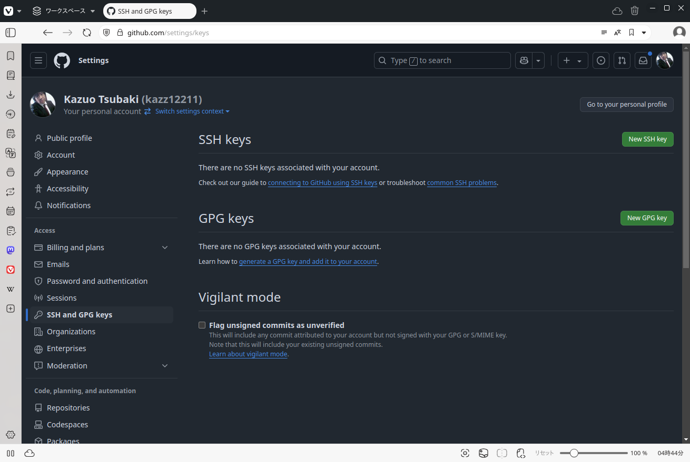
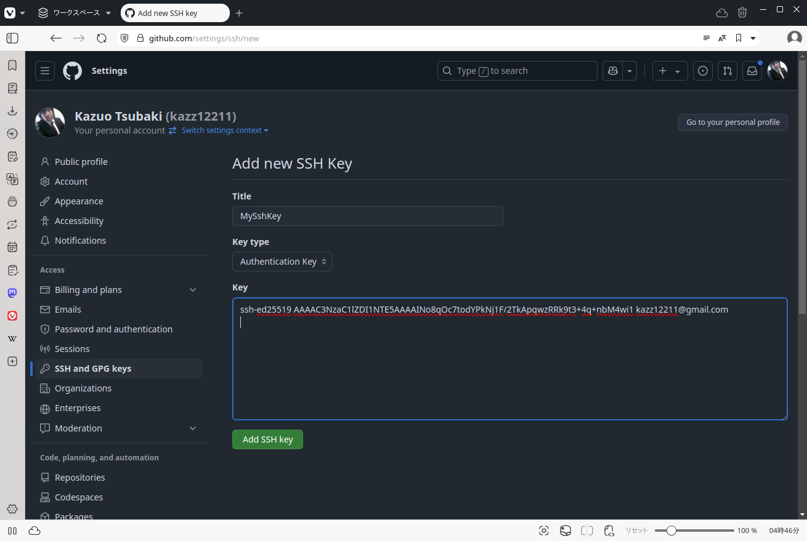

# Linux (Ubuntu) 開発者向けセットアップ

## gitのインストール

```
sudo apt update
sudo apt install git
```

Ubuntuは最初からgitがインストールされている筈ですので、この作業は不要。

## neovimのインストール

ZIKUUで使用しているNeovimの設定です。インストールするには次のコマンドを実行します。次のコマンドでインストールします。


```
sudo add-apt-repository ppa:neovim-ppa/unstable
sudo apt update
sudo apt install neovim
```

### Neovimの設定をGithubからダウンロード

```
git clone https://github.com/ZIKUU-SPACE/neovim-config.git $HOME/.config/nvim
```

### Packerのインストール

PackerはNeovim用のパッケージマネージャーです。

次のコマンドでPacker をインストールします。

```
git clone --depth 1 https://github.com/wbthomason/packer.nvim\
 ~/.local/share/nvim/site/pack/packer/start/packer.nvim
```

### Neovimプラグインのインストール

nvimを起動して、PackerInstallコマンドを実行します。

## VSCodiumのインストール

```
sudo apt update
sudo apt upgrade
sudo apt install dirmngr software-properties-common apt-transport-https curl -y
curl -fSsL https://gitlab.com/paulcarroty/vscodium-deb-rpm-repo/raw/master/pub.gpg | sudo gpg --dearmor | sudo tee /usr/share/keyrings/vscodium.gpg > /dev/null
echo deb [signed-by=/usr/share/keyrings/vscodium.gpg] https://download.vscodium.com/debs vscodium main | sudo tee /etc/apt/sources.list.d/vscodium.list
sudo apt update
sudo apt install codium -y
```

## zshのインストール

###ケージマネージャを使ってzshをインストール

```
sudo apt update
sudo apt install zsh
```

### zshをデフォルトシェルにする

```
sudo chsh -s $(which zsh)
```

一旦ログアウトしてログインする。

### zshプラグインをインストールする

gitがインストールされていない場合は次のコマンドでgitをインストールする。

```
sudo apt install git
```

プラグインのインストール

```
sh -c "$(curl -fsSL https://install.ohmyz.sh/)"
```


## Githubへのsshキーの登録

### sshキーの生成

```
ssh-keygen -C メールアドレス

[出力]
Generating public/private ed25519 key pair.
Enter file in which to save the key (/home/ユーザー名/.ssh/id_ed25519): 
Enter passphrase (empty for no passphrase): 
Enter same passphrase again: 
```
Passphraseを入力する（推奨）。入力しなくても良い。

こんな出力が得られる。

```
Your identification has been saved in /home/ktsubaki/.ssh/id_ed25519
Your public key has been saved in /home/ktsubaki/.ssh/id_ed25519.pub
The key fingerprint is:
SHA256:c4y4ScmAyOdil9M9/Hi/GYJrrCA7rvTtORyWixxf5qY メールアドレス
The key's randomart image is:
+--[ED25519 256]--+
|                 |
|.. .             |
|.....            |
|  o oooo o       |
| o = .*+S o      |
|. o..= ==o       |
| o..* Xo + .     |
|..+oo=.=o o o    |
|+o...E*.   +.    |
+----[SHA256]-----+
```

### 公開キーをクリップボードにコピーする

```
cat ~/.ssh/id_ed25519.pub

[出力]
ssh-ed25519 AAAAC3NzaC1lZDI1NTE5AAAAINo8qOc7todYPkNj1F/2TkApqwzRRk9t3+4q+nbM4wi1 メールアドレス
```

### Githubサイトを開く



### Settingsメニューを選ぶ


### SSHキー登録画面を選ぶ



### クリップボードにコピーした公開キーを登録する



### Githubに接続確認

```
ssh -T git@github.com

[出力]
The authenticity of host 'github.com (20.27.177.113)' can't be established.
ED25519 key fingerprint is SHA256:+DiY3wvvV6TuJJhbpZisF/zLDA0zPMSvHdkr4UvCOqU.
This key is not known by any other names.
Are you sure you want to continue connecting (yes/no/[fingerprint])? yes
Warning: Permanently added 'github.com' (ED25519) to the list of known hosts.
Hi kazz12211! You've successfully authenticated, but GitHub does not provide shell access.
```

## Dockerのインストール

公式ページによるインストール方法

```
sudo apt-get update

sudo apt-get install ca-certificates curl

sudo install -m 0755 -d /etc/apt/keyrings

sudo curl -fsSL https://download.docker.com/linux/ubuntu/gpg -o /etc/apt/keyrings/docker.asc
sudo chmod a+r /etc/apt/keyrings/docker.asc

echo \
  "deb [arch=$(dpkg --print-architecture) signed-by=/etc/apt/keyrings/docker.asc] https://download.docker.com/linux/ubuntu \
  $(. /etc/os-release && echo "$VERSION_CODENAME") stable" | \
  sudo tee /etc/apt/sources.list.d/docker.list > /dev/null

sudo apt-get update


sudo apt-get install docker-ce docker-ce-cli containerd.io docker-buildx-plugin docker-compose-plugin
```

一般ユーザ権限でDockerを使用できるようにする。
```
sudo groupadd docker
sudo usermod -aG docker $USER
```

